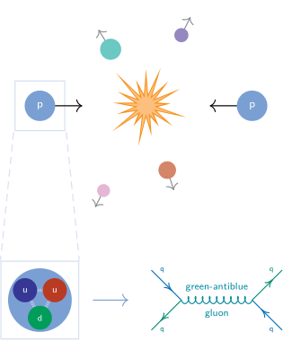
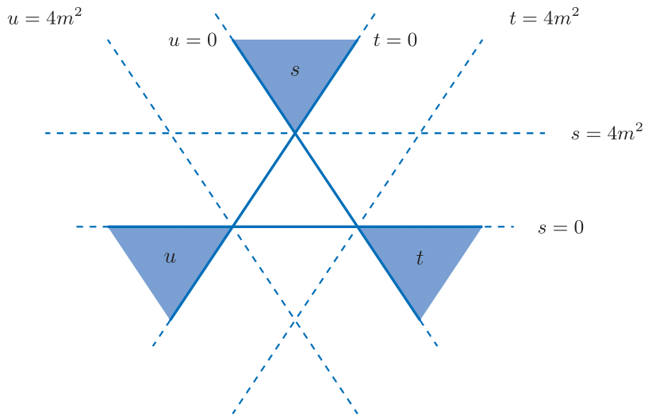

# phys-tikzpicture-collection
Assortment of Tikz figures I have made for gradschool and teaching.
Compiled with LuaLaTex
  
***Samples:***

Proton Collision

  

Scattering channel kinematic domains

  

2->2 Scattering

